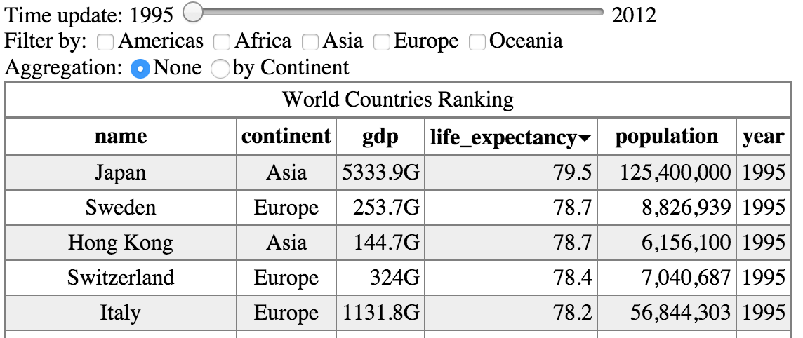
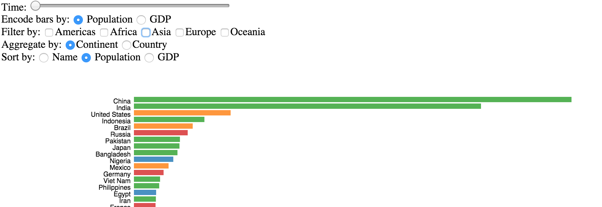

D3.js Data Visualization Project 1
===

In this project, I will use [D3](http://d3js.org/) to create interactive and visual rankings of countries. First, I will build an interactive HTML data table to visualize, order, aggregate, and filter countries by name, population, or GDP, for one or multiple years. Ir result will look like this.
 

	

 Then, I will use SVG to encode country properties into a horizontal bar chart, for a result like that:

	

This project is designed to help I gain fundamental skills in HTML, JavaScript, and D3, and to gain insights into a relatively small dataset. Successfully completed, I will be able to:

1. Handle basic data operations such as loading, filtering, and aggregating data using D3.
2. Display data as an HTML table and connect user interface (UI) elements (sliders, radio buttons, and check-boxes) to interact with this table.
3. Create an SVG bar chart that uses similar interaction techniques as the HTML table but includes interactive transitions to react to updates.
4. Eventually learn more about world's countries using those rankings.